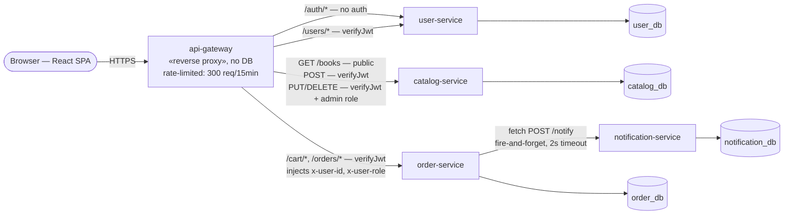
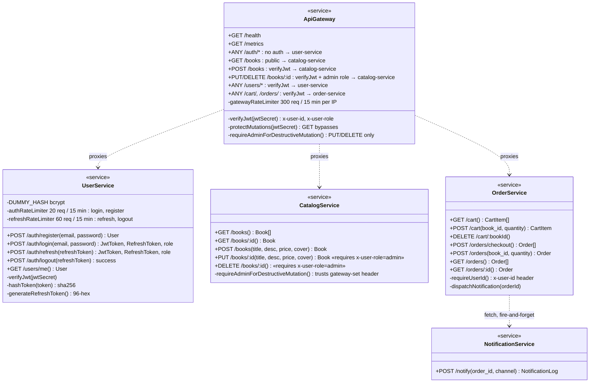
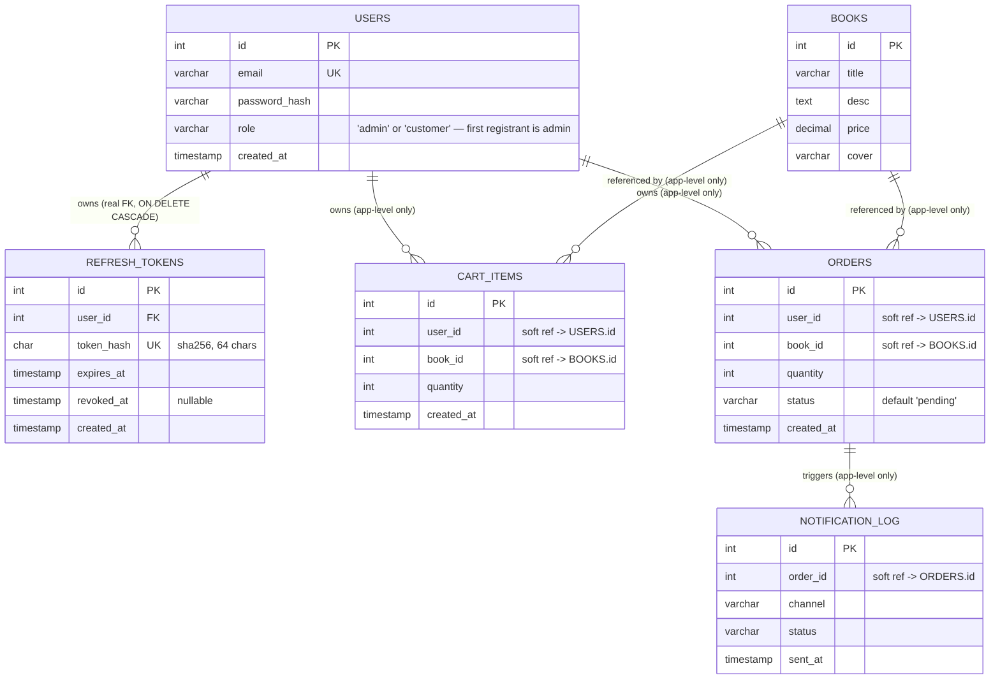
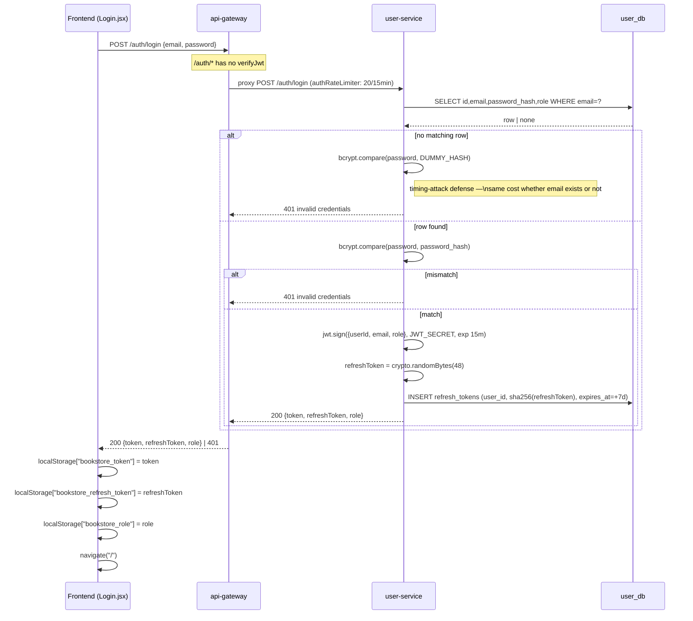
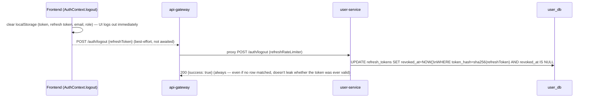
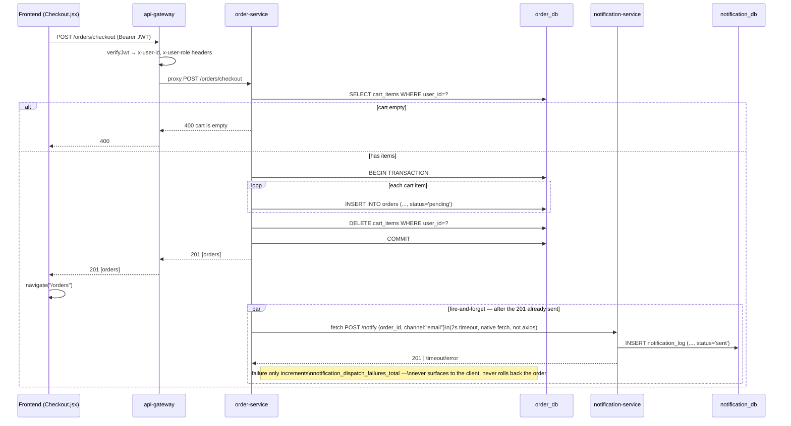
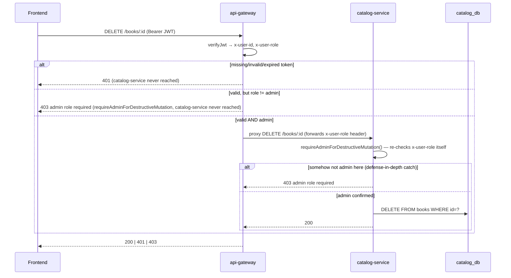
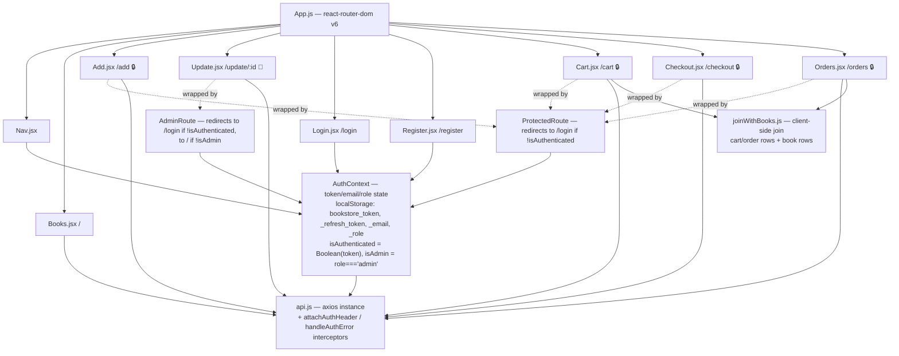

# Application UML

UML of the **application layer** only (not infrastructure — see [`ARCHITECTURE.md`](ARCHITECTURE.md) for that). Rendered with Mermaid, native in this file on GitHub/GitLab/most Markdown viewers. Verified against real source as of 2026-08-23: `services/{api-gateway,catalog-service,user-service,order-service,notification-service}` (flat single-file Express apps — one `app.js` factory + `index.js` entrypoint each, no `routes/`/`controllers/`/`models/` subdirs, no ORM, raw `mysql2` SQL) and `client/src/` (React, react-router-dom v6).

---

## 1. Component diagram — services



**Only real inter-service call is `order-service → notification-service`.** `order-service` never calls `catalog-service` (no server-side book/price validation — the `orders` table doesn't even store price). Every service exposes `GET /health` and `GET /metrics` (prom-client) — omitted above for clarity. `catalog-service` also independently checks `x-user-role` on `PUT`/`DELETE /books/:id` as defense-in-depth (see section 2) — it is no longer identity-blind, even though `api-gateway` is still the only place a JWT is ever verified.

---

## 2. Class diagram — service interfaces

Not object classes (there are none — every service is stateless functions over `mysql2` pools). This models each service as its public HTTP interface, `«service»` stereotype, methods = routes.



**JWT is verified in exactly two places**: `ApiGateway.verifyJwt` (every proxied call needing auth) and `UserService.verifyJwt` on `GET /users/me` only (redundant, self-contained re-check). `OrderService` and `NotificationService` never verify a token themselves — `OrderService` trusts the `x-user-id` header the gateway injects. `CatalogService` trusts the gateway-injected `x-user-role` header as a **second, independent check** on `PUT`/`DELETE /books/:id` — a deliberate defense-in-depth layer, not reliance on the gateway/NetworkPolicy boundary alone. The refresh token (`/auth/refresh`, `/auth/logout`) is never a JWT and is never verified by `verifyJwt` — it's an opaque random value, looked up by its SHA-256 hash directly against `user_db.refresh_tokens`, entirely inside `UserService`.

**Role model:** two roles, `admin` and `customer`. The **first account ever registered** becomes `admin` automatically (`user-service` counts existing rows atomically inside the registration transaction); every subsequent registration is `customer`. The role is baked into the JWT (`{userId, email, role}`) at login/refresh time — there is no separate role-lookup call, and no way to promote a user to admin after the fact short of a direct DB edit. `role` also travels back to the frontend in the login/refresh response body and is persisted in `localStorage["bookstore_role"]`.

---

## 3. Entity-relationship diagram — data model

Four **separate physical databases** (`catalog_db`, `user_db`, `order_db`, `notification_db`), one per service, on the same shared RDS instance. Cross-database references (`user_id`/`book_id`/`order_id` on tables outside `user_db`) are plain `INT` columns with no SQL `FOREIGN KEY` — enforced only in application code, since a FK can't cross a schema boundary that's meant to be a real isolation boundary. `REFRESH_TOKENS` is the one exception: it lives in the *same* schema as `USERS` (`user_db`), no boundary is being crossed, so it has a real, enforced `FOREIGN KEY ... ON DELETE CASCADE` — don't read that as an inconsistency, it's a deliberate distinction between within-schema and cross-schema references.



`CART_ITEMS` has a real DB-level constraint worth noting even though it's not a FK: `UNIQUE(user_id, book_id)`, which is what makes `POST /cart`'s `INSERT ... ON DUPLICATE KEY UPDATE quantity=?` behave as an upsert. `ORDERS` doesn't store `price` — the checkout flow never looks it up, so an order's value can only be reconstructed by joining back to `BOOKS.price` at read time (which is exactly what the frontend's `joinWithBooks.js` does).

---

## 4. Sequence — register &amp; login



Registration (`POST /auth/register`, same `authRateLimiter`) is one call earlier and not shown above — it does not log the user in. Inside `user-service`, the very first row ever inserted into `users` gets `role='admin'`, computed via a `SELECT COUNT(*)` inside the same request before the `INSERT`; every registration after that gets `role='customer'`. There is no admin-promotion endpoint.

---

## 4b. Sequence — silent access-token refresh (no user interaction)

Fires from `client/src/api/api.js`'s response interceptor the instant any non-auth API call comes back `401` (access token expired, 15 minutes in) — not a page the user visits.

```mermaid
sequenceDiagram
  participant FE as Frontend (api.js interceptor)
  participant GW as api-gateway
  participant US as user-service
  participant DB as user_db

  FE->>GW: (any request) — 401, access token expired
  Note over FE: handleAuthError: not an /auth/* URL,\nnot already retried once → attempt refresh
  FE->>US: POST /auth/refresh {refreshToken}  (direct, bypasses gateway's verifyJwt — no access token to verify)
  US->>DB: SELECT id,user_id FROM refresh_tokens\nWHERE token_hash=sha256(refreshToken) AND revoked_at IS NULL AND expires_at>NOW()
  alt not found / revoked / expired
    US-->>FE: 401 invalid or expired refresh token
    FE->>FE: clearSession(); navigate("/login")
  else found
    US->>DB: SELECT id,email,role FROM users WHERE id=user_id
    US->>DB: UPDATE refresh_tokens SET revoked_at=NOW() WHERE id=?  (rotate: burn the one just used)
    US->>US: newRefreshToken = crypto.randomBytes(48)
    US->>DB: INSERT refresh_tokens (user_id, sha256(newRefreshToken), expires_at=+7d)
    US->>US: jwt.sign({userId, email, role}, JWT_SECRET, exp 15m)
    US-->>FE: 200 {token: newAccessToken, refreshToken: newRefreshToken, role}
    FE->>FE: localStorage updated with all three values
    FE->>GW: retry the ORIGINAL failed request, Authorization: Bearer newAccessToken
    GW-->>FE: the response the user actually asked for
  end
```

Concurrent 401s (a burst of parallel calls right as the token expires) dedupe onto one shared in-flight refresh promise — since refresh rotates the token, a second concurrent call would otherwise revoke the first call's brand-new token before anything ever used it. Refresh and logout share a separate, looser rate limit (`refreshRateLimiter`, 60/15min) from login/register (`authRateLimiter`, 20/15min) — automated background refresh traffic across multiple open tabs could otherwise hit the tighter human-login limit on its own.

## 4c. Sequence — logout (real, server-side revocation)



This is the actual revocation the old plain-JWT design couldn't do at all: after this call, that specific refresh token can never mint another access token, even though whatever access token was already issued off it keeps working for up to 15 more minutes (its own natural expiry) — a much smaller window than the old scheme's flat, unrevocable 1 hour.

---

## 5. Sequence — checkout



`order-service` never calls `catalog-service` in this flow — no server-side price/stock validation happens anywhere in checkout.

---

## 6. Sequence — admin-only catalog mutation (identity boundary, two layers deep)

Shows the two independent checks a `PUT`/`DELETE /books/:id` now passes through — `api-gateway` first, `catalog-service` itself second (defense-in-depth, not redundancy for its own sake: the second check holds even if the gateway's own logic ever had a gap).



`POST /books` (adding a new book) only needs `api-gateway`'s `protectMutations` (any authenticated user, no admin check anywhere) — only editing (`PUT`) or deleting (`DELETE`) an *existing* book requires admin, at both layers.

---

## 7. Frontend component diagram



`🔒` = wrapped in `ProtectedRoute` (logged-in only). `🔐` = wrapped in `AdminRoute` (logged-in **and** `role==='admin'`) — currently only `/update/:id`; adding a book (`/add`) is deliberately just `ProtectedRoute`, matching `api-gateway`'s `POST /books` (any authenticated user, not admin-gated). Both route guards are UX only, not a security boundary — the real boundary is `api-gateway`'s `verifyJwt`/`requireAdminForDestructiveMutation`, backed by `catalog-service`'s own second check (section 6).

---

## Facts worth remembering when reading these diagrams

- **No ORM anywhere.** Every service uses raw SQL via `mysql2` (callback-style, except `order-service`'s checkout endpoint, which uses `.promise()` for the transaction). No Sequelize/TypeORM/Prisma.
- **No `axios` in any backend service.** `order-service → notification-service` uses native `fetch` with `AbortSignal.timeout(2000)`. `axios` is frontend-only.
- **JWT claims:** `{ userId, email, role, iat, exp }`, HS256, **15-minute** expiry (was a flat, unrevocable 1h — see the refresh-token pair, sections 4b/4c). `JWT_SECRET` is shared between `user-service` (sign + verify) and `api-gateway` (verify only), via a Kubernetes `ExternalSecret` synced from AWS Secrets Manager.
- **The refresh token is never a JWT** — 48 random bytes (`crypto.randomBytes`), hex-encoded, 7-day expiry, rotated on every use. Only its SHA-256 hash is ever stored (`user_db.refresh_tokens.token_hash`) — same principle as password hashing, a stolen DB row isn't a usable credential on its own.
- **Two roles, no promotion path.** `admin` (first-ever registrant, automatic) and `customer` (everyone else). There is no endpoint or UI to promote a `customer` to `admin` after the fact — only a direct DB edit.
- **Rate limiting, three independent limiters, all `express-rate-limit`:** `api-gateway`'s `gatewayRateLimiter` (300 req/15min, every route), `user-service`'s `authRateLimiter` (20 req/15min, login+register only) and `refreshRateLimiter` (60 req/15min, refresh+logout — deliberately looser since background token refresh across multiple tabs is a different traffic pattern than a human typing a password).
- **`api-gateway` deliberately has no `express.json()`** — parsing the body would consume the stream `http-proxy-middleware` needs to forward it untouched.
- **Registration does not log the user in** — `POST /auth/register` returns `{id, email, role}`, no token; the frontend redirects to `/login` afterward.
- **The alternate `POST /orders` endpoint (single-item, bypasses cart) exists in `order-service` but no frontend page calls it** — dead code from the UI's perspective, still live and reachable via the gateway.
- **Test runner is `vitest` + `supertest`** in every service (not `jest`, despite `jest`-style syntax being common elsewhere in the JS ecosystem).

## Related

- [`ARCHITECTURE.md`](ARCHITECTURE.md) — narrative infra + app overview
- [`DEPLOYMENT.md`](DEPLOYMENT.md) — how to stand this up
- [`../README.md`](../README.md) — tech stack, repo structure, local development, CI/CD overview
