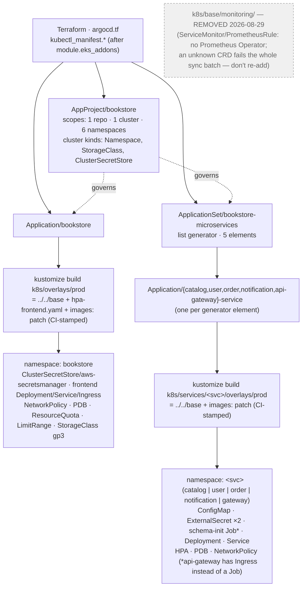
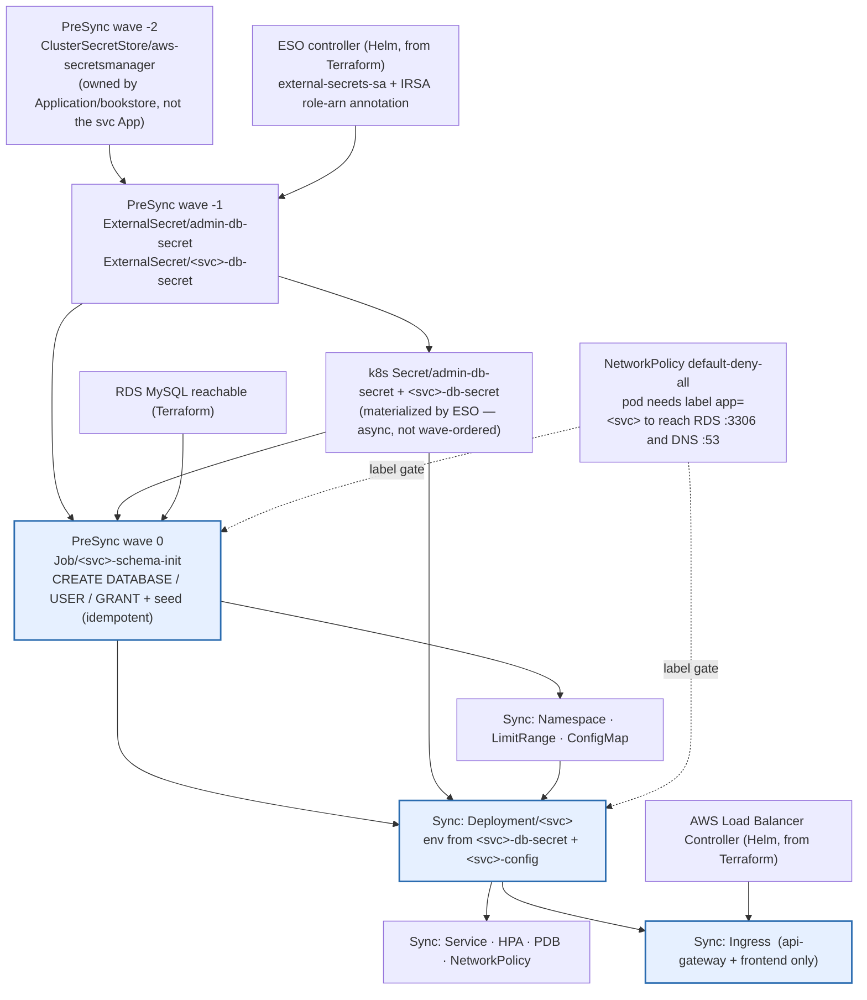

# Kubernetes dependency graph — what deploys, and in what order

The Terraform graph is one thing Terraform resolves for you. On the k8s side
there are **two** orderings that matter, and neither is the file layout:

1. **Build-time composition** — how `kustomize build` assembles the manifests
   ArgoCD actually applies (overlay → base → resource files → image-tag patch).
2. **Runtime sync order** — ArgoCD's PreSync/Sync/PostSync phases and
   `sync-wave` numbers, which decide what lands before what on a real cluster.

Personal reference notes — a local snapshot, gitignored, not a maintained
doc. Covers `main` (single cluster). Verified against `k8s/` and
`terraform/argocd.tf` on 2026-08-29. The `dr` branch's copy adds a "Graph C"
for the standby cluster's own `k8s/argocd/dr/` tree — not here.

---

## Graph A — who deploys what



- **`Application/bookstore`** renders `k8s/overlays/prod` → the `bookstore`
  namespace: the React frontend plus the three cluster-scoped resources the
  whole platform shares (`ClusterSecretStore`, `StorageClass`, and the
  `Namespace` itself).
- **`ApplicationSet/bookstore-microservices`** stamps out one `Application`
  per list entry, each rendering `k8s/services/<svc>/overlays/prod` into its
  own namespace. Adding a 6th service = one more list element, no new file.
- Each overlay is thin: `resources: [../../base]` plus an `images:` block that
  **CI rewrites** every deploy (`kustomize edit set image …` on the
  *overlay*, never the base).
- `k8s/base/monitoring/` (`ServiceMonitor`/`PrometheusRule`) was **removed
  2026-08-29** — `monitoring.coreos.com` CRDs with no Prometheus Operator to
  register them, and an unknown resource type fails the **entire** Application
  sync, not just those two objects (OBS-012). The `base/kustomization.yaml`
  comment says don't reintroduce them.

---

## Graph B — sync order within one microservice

ArgoCD runs **all PreSync hooks** (in ascending `sync-wave`) → then the whole
**Sync phase** → then PostSync. The k8s `Secret` objects are not ArgoCD
resources at all: the ESO controller materializes them from the
`ExternalSecret`s on its own reconcile loop, and anything waiting on them just
retries until they appear.



Blue = the slow lane on a fresh cluster: the schema-init Job (waits on ESO's
first reconcile, then a live RDS round-trip), the Deployment (ECR image pull +
`/health` readiness gate), and the Ingress (ALB controller has to provision a
real load balancer — minutes).

---

## Sync waves

| Phase / wave | Resources | Waits on | Notes |
|---|---|---|---|
| **PreSync −2** | `ClusterSecretStore/aws-secretsmanager` | ESO controller running | Only in `Application/bookstore`. Must be a hook — as a plain Sync resource it applies *after* every PreSync hook, so every `ExternalSecret`'s first reconcile fails "ClusterSecretStore not found" (OBS-030). |
| **PreSync −1** | `ExternalSecret/admin-db-secret`, `ExternalSecret/<svc>-db-secret` | wave −2 + ESO + IRSA on `external-secrets-sa` | The IRSA annotation bug lived here — SA created with no `role-arn`, every pull failed silently. |
| *(async)* | k8s `Secret` objects | ESO reconcile of the above | Not ArgoCD-ordered. Consumers retry until present. |
| **PreSync 0** | `Job/<svc>-schema-init` | wave −1 secrets materialized + RDS reachable | `mysql:8.0` pod, idempotent SQL. Pod label `app:<svc>` required or default-deny-all NetworkPolicy blocks egress to :3306/:53. `hook-delete-policy: BeforeHookCreation,HookSucceeded` so a *failed* job is also cleaned before the next sync (OBS-015). **api-gateway has no such Job.** |
| **Sync** | Namespace, LimitRange, ConfigMap, Deployment, Service, HPA, PDB, NetworkPolicy, Ingress | all PreSync hooks succeeded | Deployment env: `DB_*` from `<svc>-db-secret`, `DB_PORT`/`DB_NAME`/`APP_PORT` from `<svc>-config`. |
| *(async)* | ALB | frontend + `api-gateway` `Ingress` objects | AWS Load Balancer Controller reconciles the Ingress, auto-discovers the ACM cert (no `certificate-arn` annotation), provisions one shared ALB via `group.name`. |

---

## Critical path (fresh cluster, from ArgoCD installed)

```
module.eks_addons installs ArgoCD (Terraform)
  → kubectl_manifest.argocd_appproject → argocd_application / applicationset
  → [Application/bookstore]  ClusterSecretStore                 (PreSync −2)
  → [Application/<svc>]      ExternalSecret admin + db          (PreSync −1)
  → ESO first reconcile → k8s Secret materialized              (async, ~seconds)
  → Job/<svc>-schema-init → RDS round-trip: CREATE DATABASE/USER (PreSync 0)
  → Deployment/<svc> → ECR image pull → /health readiness       (Sync)
  → Service / HPA / PDB / NetworkPolicy                         (Sync)
  → api-gateway Ingress → ALB controller provisions ALB         (async, minutes)
```

The 5 microservice Applications sync **in parallel** with each other — no
ordering between them. Within each, the PreSync chain is strictly serial.
`api-gateway` is effectively the long pole because its `Ingress` gates
external traffic and the ALB takes minutes to come up.

---

## Places the file layout lies about order

1. **An unknown CRD fails the whole batch, not just itself.** `ServiceMonitor`
   / `PrometheusRule` under `k8s/base/monitoring/` were never in
   `base/kustomization.yaml` — because including even one would break *every*
   resource in the `bookstore` Application's sync (OBS-012). The files
   themselves were deleted 2026-08-29 (`cdbd5cc`); the `base/kustomization.yaml`
   comment records why not to bring them back.

2. **`ClusterSecretStore` sits in `k8s/base/secrets/external-secret.yaml` next
   to nothing that depends on it visually — but it's wave −2 and a PreSync
   hook.** Drop the hook annotations and it becomes a plain Sync resource that
   ArgoCD applies *after* all PreSync hooks, guaranteeing every
   `ExternalSecret` fails first reconcile on a fresh cluster (OBS-030).

3. **The schema-init Job and its `ExternalSecret`s are in the same `base/`
   folder, listed adjacently — but they're in different ArgoCD phases.** Both
   are PreSync hooks; the Job is wave 0, the secrets wave −1. Without the
   explicit waves the Job's first pod starts before the Secret exists
   ("secret not found", CreateContainerConfigError, 15-min retry loop —
   OBS-013).

4. **Cross-Application order is not guaranteed.** The 5 service Applications
   reference `ClusterSecretStore/aws-secretsmanager` by name, but the
   `bookstore` Application owns it. ArgoCD doesn't sequence across
   Applications — a fresh cluster relies on retry/backoff until `bookstore`
   has synced the store.

5. **`api-gateway/base/kustomization.yaml` has `ingress.yaml` where every
   other service has `schema-init-job.yaml`.** Same list position, completely
   different resource — api-gateway is stateless (no schema, no DB user) and
   is the only backend with an Ingress.

6. **CI edits the overlay, not the base.** `kustomize edit set image` in the
   deploy job rewrites `overlays/prod/kustomization.yaml`'s `images:` block;
   `base/` never carries a real tag.

---

## Regenerate the real thing

```bash
# Exactly what ArgoCD will apply:
kustomize build k8s/overlays/prod
kustomize build k8s/services/catalog-service/overlays/prod

# From a running ArgoCD:
argocd app manifests bookstore
argocd app resources  catalog-service     # live tree + sync-wave per resource
argocd app get        catalog-service --show-operation

# Hook/wave annotations across the repo:
grep -rn 'argocd.argoproj.io/\(hook\|sync-wave\)' k8s/
```
