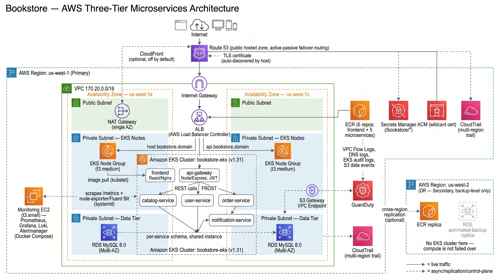
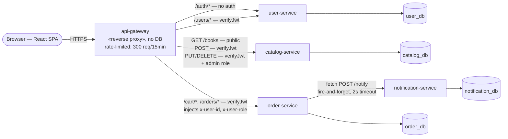
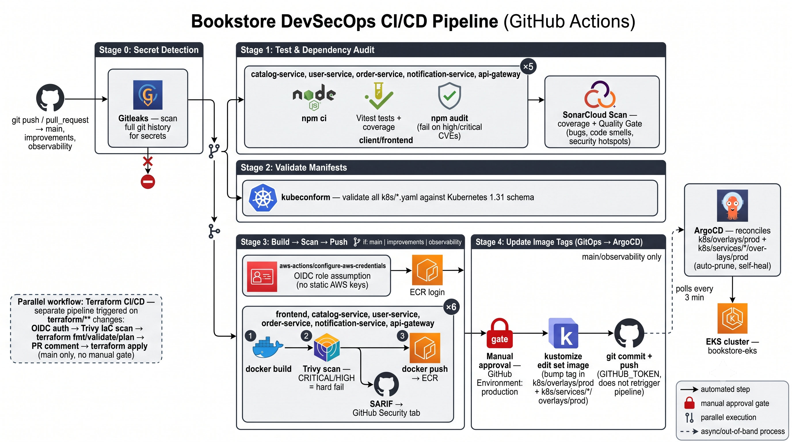
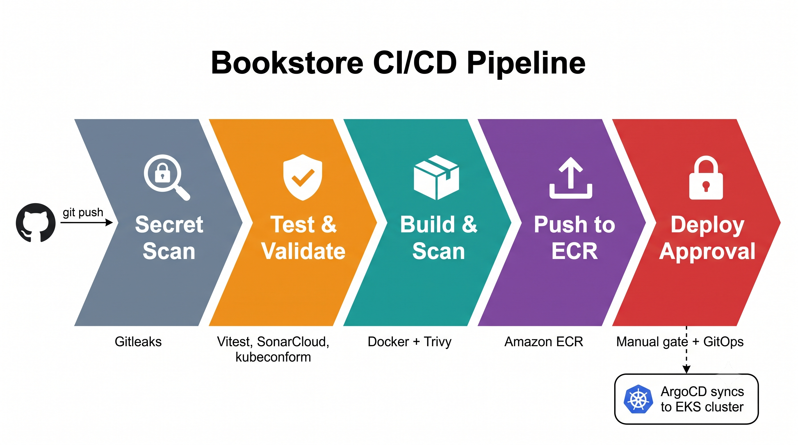
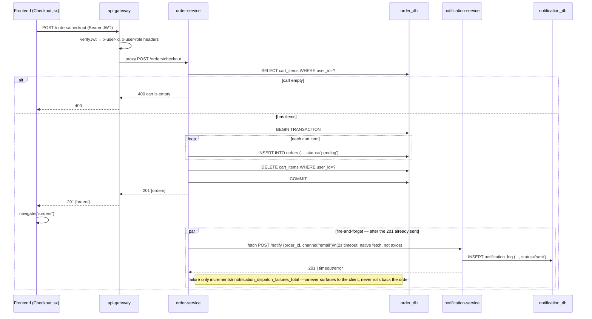

# Rebuilding a Bookstore App as 5 Microservices on EKS

What actually breaks when you split a monolith into microservices? I took a working three-tier bookstore — one React frontend, one Node/Express backend, one MySQL database — and rebuilt the backend as five independent services on Amazon EKS (AWS's managed Kubernetes), with the infrastructure in Terraform, delivery through ArgoCD, and a CI/CD pipeline that can block a release at five separate points. I found out the expensive way. What follows is the architecture, then four incidents from standing it up, each traced from symptom back to root cause.

The build ran to about 2,000 lines of Terraform. The pipeline has five checkpoints and any one of them can stop a release. Observability was the part that didn't work first time  the initial in-cluster design failed outright and got rebuilt on a separate box. Disaster recovery got built and then audited honestly, which mostly meant finding out how much less it covered than I'd assumed.

Nothing here was driven by a production problem. It came from the gap between reading how distributed systems fail and actually running one  watching the failure modes happen on infrastructure I owned, with a real bill attached, and tracing each back to its root cause from `kubectl get pods` outward.

The post is long and sectioned  jump to what's relevant. If you only read two: **Monitoring vs. the cluster's own resource limits** and **the External Secrets bug**. Both are cases where the system looked healthy for long enough that the debugging process itself is the more useful part of the story.

---

## Architecture overview



**Entry point:** Route53 with active-passive failover routing. CloudFront is provisioned but disabled by default  not yet justified at this traffic level.

**Ingress:** a single ALB, EKS node group split across two AZs in one VPC.

Five services, each owning a single responsibility:

- **api-gateway** — the only ingress point the frontend calls. Verifies the JWT, routes the request.
- **catalog-service** — book catalog. Public reads, authenticated writes, admin-gated edits/deletes.
- **user-service** — authentication. The only service that issues JWTs.
- **order-service** — cart and checkout.
- **notification-service** — logs a notification after checkout. No other service calls it, and the frontend has no knowledge it exists.

The actual service map, pulled from source rather than reconstructed from memory:



**Two things I'll call out:**

- `order-service → notification-service` is the only real inter-service call in the system. `order-service` never calls `catalog-service` — there's no server-side price or stock validation anywhere in checkout; the `orders` table doesn't store a price column at all.
- `catalog-service` isn't fully identity-blind. It independently re-validates the `x-user-role` header the gateway injects before allowing a `PUT`/`DELETE` — a deliberate second layer, not a dependency on the gateway's decision alone.

**Stack:** Node/Express throughout, each service in its own namespace, all against one RDS MySQL instance — but each with its own schema, not its own server. The trade-off reasoning is below.

**Supporting infrastructure:**

- Images in ECR — six repositories, frontend plus five services.
- Pulled through an S3 gateway VPC endpoint, so image pulls never traverse the public internet.
- Secrets in Secrets Manager under `bookstore/*`.
- TLS via a wildcard ACM cert, terminated at the ALB.

**Explicitly out of scope for this iteration:** service mesh, message queue, distributed tracing, gradual rollouts. These are documented trade-offs, not oversights — covered at the end.

---

## Terraform's build order isn't the file's order

This one caught me the first time I read a plan closely: **the order resources appear in a `.tf` file has nothing to do with the order Terraform builds them.** Terraform works out the full dependency graph and builds anything that isn't waiting on something else in parallel, wherever it sits in the file.

My database and cluster modules don't reference each other — both depend only on the network layer. So despite the database module being declared earlier, Terraform provisions both concurrently.

- Database: ~10–15 min
- Cluster: ~15–20 min
- Full stand-up: roughly the slower of the two, not the sum

**Provisioning was straightforward. Teardown was not.** AWS and Kubernetes both create infrastructure as side effects that Terraform never tracked. It will attempt to delete a VPC with an untracked dependent resource still attached, and fail with an error that gives no indication of the actual blocker.

Two cleanup scripts run specifically at teardown:

- **Leftover ENIs and security groups** — created by Kubernetes/EKS outside Terraform's visibility. The script polls for up to 5 minutes and deletes whatever AWS's own cleanup left behind after a non-retried failure.
- **Load balancer teardown** — deletion isn't instantaneous. The script deletes the Kubernetes object first (which triggers the actual AWS teardown), fails loudly if that step fails, then polls every 10 seconds for up to 20 minutes until the managed security group is confirmed gone.

*(A third script previously handled CloudWatch/CloudTrail/GuardDuty cleanup. Removed once it was clear nothing consumed that telemetry — no alerting on GuardDuty findings, no process ever read a CloudTrail event. Simpler teardown, lower cost.)*

**Takeaway:** a meaningful amount of what a cloud provider creates on your behalf never appears in the tool responsible for tracking your infrastructure. That has to be accounted for explicitly, not assumed away.

---

## Monitoring vs. the cluster's own resource limits

If you skim one section, read this one.

**Approach:** standard guidance — install the kube-prometheus-stack via Helm, in one pass.

**Result:** the install stalled entirely.

```
kubectl get pods
```

showed a growing set of pods stuck in `Pending` — not just the new monitoring pods, but existing application pods that had been running without issue for weeks. `Pending` has one specific meaning: the scheduler evaluated every node and found no placement.

**Root cause:** the cluster was running on a single `t3.medium`. AWS caps how many pods an instance can run based on how many network interfaces (ENIs — the virtual network cards each pod needs its own IP address from) that instance type can attach, not its CPU or memory. For a `t3.medium`, that ceiling is fixed at 17 pods, regardless of how much spare capacity the machine actually has.

- Already allocated: 5 services plus redundant gateway replicas
- Additional scheduling request: Prometheus, Grafana, Alertmanager, kube-state-metrics, a logging DaemonSet

Insufficient capacity. Nothing scheduled.

**Fix:** not a larger instance — removing the monitoring stack from Kubernetes scheduling entirely. Prometheus, Grafana, and Loki now run together on a dedicated `t3.small` via Docker Compose, outside the scheduler's authority.

```
# Prometheus + Grafana + Loki run on a dedicated t3.small EC2 instance
# rather than inside EKS. This frees ~600 MB RAM on the single t3.medium
# node and prevents kube-prometheus-stack from timing out during helm
# install.
```

The cluster now runs zero monitoring pods.

The remaining two host-level jobs run outside the monitoring EC2 entirely — they live on the EKS worker nodes themselves, installed by the EKS module's own node launch template (`node-user-data.sh.tftpl`), not the monitoring instance's boot script. `node-exporter v1.8.2` and Fluent Bit run as systemd services directly on each node, not as DaemonSets — the entire point being zero monitoring pods scheduled inside the cluster. Fluent Bit doesn't get a static address to ship logs to; it discovers the monitoring EC2's private IP itself at boot via `aws ec2 describe-instances` (retried — the node's own IAM permission for that call can lose the same propagation race described below), since the monitoring instance's public Elastic IP doesn't route back cleanly from a private subnet within the same VPC.

### How the monitoring instance provisions and wires itself

Here's the full sequence, checked line by line against the Terraform and the boot script.

**1. Installation happens through EC2 user data, not a manual SSH session.** Terraform hands the instance a boot script (AWS calls this "user data" — code an EC2 instance runs exactly once, automatically, the moment it first boots). That script installs Docker plus the Compose plugin from Docker's own apt repository (Ubuntu's default repos don't carry the plugin), installs `kubectl` v1.31.0, then fetches three separate secrets from AWS Secrets Manager: the Grafana admin password, a shared basic-auth credential for Prometheus and Alertmanager (neither tool ships with built-in login, so without this anyone inside the allowed IP range could hit either UI with no credentials at all — including silencing a firing alert via Alertmanager's own API), and the SES SMTP credentials. Each fetch retries up to 20 times, 6 seconds apart — deliberately, because the IAM policy granting the instance permission to read these secrets is created in the same `terraform apply` as the instance itself, and IAM permissions aren't instantly consistent. The very first boot can genuinely lose that race.

**2. Two background jobs keep the picture current after boot**, both installed as cron entries: one refreshes the Kubernetes access token every 10 minutes and restarts the `kube-state-metrics` container each time (it only reads its kubeconfig once at startup, so a stale token would otherwise stick permanently); another rewrites Prometheus's scrape-target files every 5 minutes by querying `aws ec2 describe-instances`, so nodes joining or leaving the cluster get picked up without a Prometheus restart.

**3. Dashboards arrive two different ways, and the distinction matters.** Exactly one dashboard is pulled live: "Node Exporter Full," a well-known community dashboard (Grafana.com ID `1860`, revision `37` specifically pinned), downloaded and `POST`ed into Grafana through its own import API, with the datasource reference rewritten to point at the local Prometheus. Two other dashboards — a custom pod/node resource view and a cluster overview — are hand-built, checked directly into the repo as JSON, and reach Grafana purely through file provisioning: dropped into a folder Grafana watches on startup, no API call, no download, no dashboard ID involved at all. (A third community dashboard, ID `315`, was tried and dropped — it queries a label this setup's metrics don't actually produce. The custom cluster-overview dashboard is the direct replacement.)

**4. Alertmanager runs real severity-based routing**, wired to 9 specific alert rules — including `NodeDown`, `PodCrashLooping`, `HighPodCPUUsage`, and `HighErrorRate` reading each service's own request-count metric. Alerts tagged `critical` re-notify hourly; everything else, every 6 hours. An inhibit rule suppresses a `warning` for the same alert/instance while a matching `critical` is already firing, so a real incident doesn't also spam a redundant lower-severity notification for the same thing. Notifications go out over email through Amazon SES, authenticated via SMTP.

**5. The part that genuinely needs a manual step: SES's sandbox mode.** A new AWS account's SES access starts in "sandbox mode" — it won't deliver to an unverified address, and here, since the same address is deliberately used as both sender and recipient, that means nothing sends until that one address is verified. Setting `ALERT_EMAIL` in `config.env` and running `scripts/configure.py` provisions the SES identity, which automatically triggers AWS's verification email — but delivery stays off until someone actually opens that inbox and clicks the link. Skip that step and the entire pipeline looks fully wired end-to-end — rules evaluating, Alertmanager routing, no errors anywhere — while SES silently bounces every notification. If alerts look wired up but nothing lands in the inbox, the unclicked verification email is the first thing to check.

One detail underneath that's easy to miss: SMTP authentication to SES doesn't accept the IAM access key's raw secret — it needs a separately *derived* SMTP password, computed via AWS's own documented HMAC-SHA256 conversion. No native Terraform function does this, so the derivation runs as a small Python script invoked through `local-exec`, and the result is written straight to Secrets Manager — the derived password itself never appears in Terraform state.

**Caught while writing this:** the repo still had `ServiceMonitor` and `PrometheusRule` manifests under `k8s/base/monitoring/`, left over from the in-cluster design. No Prometheus Operator runs to consume them, and they weren't wired into the kustomization either — dead weight that would only mislead someone reading the repo. Deleted. If you're on an older commit, that's all those files ever were: a trap from before monitoring moved off-cluster.

**Would this exact design hold at a larger cluster?** Not necessarily — this is a direct response to one instance's fixed capacity, not a general rule. The lesson that does carry over: if the observability layer is competing with the application for the resources the application needs to run, move the observability layer. Don't shrink the application to make room for it.

---

## The deploy pipeline: ArgoCD, ApplicationSets, and one race condition



**Deploy model:** ArgoCD, following the GitOps pattern (the practice of treating a git repository as the single source of truth for what should be running, with a tool continuously reconciling the live system to match it). Git is the source of truth; ArgoCD watches it and updates the cluster to match. No manual `kubectl apply`, no direct cluster access from CI. Pipeline authentication is OIDC-based (a standards-based way to exchange a short-lived, verifiable token instead of a long-lived password), not static credentials sitting in GitHub Secrets.

**The problem at 5 services:** maintaining 5 near-identical ArgoCD Application configs. `ApplicationSet` fixes this directly — a template plus a list generates one config per entry:

```yaml
apiVersion: argoproj.io/v1alpha1
kind: ApplicationSet
spec:
  generators:
    - list:
        elements:
          - service: catalog-service,      namespace: catalog
          - service: user-service,         namespace: user
          - service: order-service,        namespace: order
          - service: notification-service, namespace: notification
          - service: api-gateway,          namespace: gateway
  template:
    spec:
      source:
        path: 'k8s/services/{{service}}/overlays/prod'
      destination:
        namespace: '{{namespace}}'
      syncPolicy:
        automated: { prune: true, selfHeal: true }
```

Adding a 6th service is a two-line addition, not a new file.

**One deliberate rule for CI:** it never runs `kubectl` against the cluster. The only thing it does once every check passes is edit one line in a config file (the image tag), commit it, and push. ArgoCD — the only thing with write access to the cluster — polls the repo every ~3 minutes and does the actual work. CI changes intent; ArgoCD changes what's actually running. Keeping those two jobs separate is deliberate: exactly one thing can touch production.

### Race condition in the tag-bump step

**Failure mode:** build-and-scan takes roughly 15 minutes. The deploy step's local repo state is therefore already 15 minutes stale by the time it attempts its commit. Two builds triggered close together cause the second `git push` to be rejected — the branch moved underneath it.

**Resolution:** catch the rejection, fetch the current branch state, rebase, retry — up to 5 attempts. If all 5 fail, the pipeline halts with a hard, visible failure rather than degrading silently, since a silent failure here means ArgoCD continues deploying a stale image indefinitely with no signal anywhere that it happened.

### The bug that cost me the most time

**Design:** secrets reside in AWS Secrets Manager, never hardcoded. External Secrets Operator (a Kubernetes tool that syncs values from an external vault into native Kubernetes Secrets) pulls them in, authenticating via IRSA — IAM Roles for Service Accounts, AWS's mechanism for giving one specific Kubernetes workload its own narrow, scoped AWS permissions, rather than every pod in the cluster sharing one broad credential.

**Failure mode:** for a period, secret sync failed silently across every service.

- No errors surfaced
- No failed logs
- No alerting anywhere

Pods that needed those secrets looked like they had a plain, boring database connection problem — the wrong thing to start debugging, and it cost real time before secret sync was even considered as the cause.

**Root cause:** the IAM trust policy authorized exactly one identity string:

```
system:serviceaccount:external-secrets:external-secrets-sa
```

The Helm release that set up the tool's Kubernetes service account had never been given that name, and was never annotated with the role's ARN. The identity AWS saw didn't match anything on the trust policy's list — not rejected, just never checked against it at all.

**Fix** — two parameters missing from the Helm configuration:

```hcl
set {
  name  = "serviceAccount.name"
  value = "external-secrets-sa"
}
set {
  name  = "serviceAccount.annotations.eks\\.amazonaws\\.com/role-arn"
  value = aws_iam_role.external_secrets.arn
}
```

The IAM policy itself was correct throughout. The gap was entirely in the installation step never being told to match it.

**Current limitation, stated directly:** all 5 services share this one AWS permission, scoped to this project's corner of the secrets vault — not 5 isolated per-service roles. Real isolation would mean a separate config per namespace instead of one shared one, which is more moving parts than a project this size needs. I'd rather say that outright than imply isolation the setup doesn't have.

---

## What every push runs through, and what the cluster enforces at runtime



Every push runs through the following, in order:

**1. Secret scanning** — Gitleaks, full git history, not just the current commit. Runs first by design: no value in building 6 container images if a secret was already committed earlier in history.

**2. Tests, dependency audit, and code quality**, running in parallel with **manifest validation**:
- Vitest executes the test suite with coverage
- `npm audit` fails the build on high/critical CVEs (frontend carries a slightly relaxed threshold, documented directly in the workflow file, for tooling dependencies with known issues and no available fix)
- SonarCloud enforces coverage plus its own quality gate
- kubeconform validates every manifest under `k8s/` against the Kubernetes 1.31 schema before anything is applied

**3. Build, scan, push** — Docker build, Trivy scan for Critical/High CVEs (hard fail, image never reaches ECR on failure), SARIF results uploaded to GitHub's Security tab.

**4. Image tag update** — `kustomize edit set image` bumps the tag in the prod overlay, commits, pushes. This is the change referenced in the pipeline section above.

**5. Manual approval** — a GitHub Environment gate on `production`. The only human-in-the-loop step in the pipeline.

### The two enforcement boundaries, and where they stop

It's easy to claim more than these two actually deliver, so here's what each does and doesn't do.

**Network policy:** every namespace defaults to deny-all, with two explicit exceptions:

```yaml
ingress:
  - from:
      - namespaceSelector:
          matchLabels: { kubernetes.io/metadata.name: gateway }
    ports: [{ port: 3000 }]
egress:
  - to: [{ ipBlock: { cidr: 170.20.0.0/16 } }]
    ports: [{ port: 3306 }]
```

✅ Stops a random unrelated pod anywhere in the cluster from reaching the database directly.
❌ Does **not** stop a compromised gateway pod from reaching everything behind it. That's exactly the gap a service mesh would close.

**Shared database instance:** one RDS instance, five isolated schemas, instead of five separate instances.

✅ A bad migration or leaked credential in one service can't reach another service's tables.
❌ If one service overloads the shared instance, every service feels it — an outage on that instance is an outage for all five at once.

A fine trade-off at this size. The first thing I'd change at real scale.

**The checkout flow, end to end** — where this boundary actually operates:



This is the actual shape of the "no message queue" decision. Checkout doesn't block on `notification-service` — dispatch happens after the client already has its `201`, and a failure there is invisible to both the client and the order state. That gap in observability, not latency, is what a queue would actually address.

---

## What "disaster recovery" actually means here

The DR posture, stated without inflation:

- Container images replicated to a second region ✅
- Database backups replicated to a second region ✅
- DNS record provisioned and ready to fail over ✅

```hcl
resource "aws_db_instance_automated_backups_replication" "secondary" {
  count             = var.dr_kms_key_id != "" ? 1 : 0
  source_db_instance_arn = module.rds.rds_instance_arn
  retention_period       = 7
}
```

That `count` conditional is deliberate — replication is off by default, and enabling it requires a self-managed KMS key, since AWS's default keys are region-locked. This is an explicit opt-in rather than a default, to avoid every deploy silently initiating cross-region replication no one requested.

**On by default:** `us-west-2` holds an ECR replica and an automated RDS backup replica, and nothing else. No EKS cluster, no running app. A full `us-west-1` loss means the data is safe and recoverable — but nothing is serving requests until you restore.

**Opt-in (`enable_dr_standby`):** the rest of the standby — a second EKS cluster and add-ons, a promotable RDS cross-region read replica, and cross-region copies of every Secrets Manager entry the cluster reads. The Route53 failover record already exists; it serves the moment the primary ALB's health check drops. Promoting the database is a manual runbook step, deliberately not automated (a promoted replica can't be un-promoted). It roughly doubles the running bill, so it stays off unless asked.

That's the honest line between backup coverage and failover capability. The switch exists; whether it's worth the second bill is a per-deployment call, not a default.

---

## Prioritized backlog

- **Service mesh** — closes the lateral-movement gap identified above; a compromised gateway pod currently has unrestricted reach downstream.
- **Per-service database instances** — the complete fix for the shared-instance trade-off, at real infrastructure cost.
- **Message queue** in place of the direct `order-service → notification-service` call. The call is already non-blocking — the fix here isn't latency, it's that a dropped notification today is unrecoverable with no retry path.
- **Distributed tracing** — request-level visibility across services instead of manual correlation across 5 log streams.
- **Canary rollouts** in place of all-at-once cutover.
- **Finish the standby-region compute stack** (`enable_dr_standby`) — the switch, secret replication, plan, and runbook are in; the second-region EKS + add-ons Terraform is the remaining build (see DR-STANDBY-PLAN.md).

If picking two: **service mesh** and **per-service databases**. Both close gaps that get expensive at real scale. Everything else matters less right now.

---

## Reference implementation

The complete implementation — Terraform, Kubernetes manifests, CI/CD workflows, ArgoCD configuration, and application code — is public: **[github.com/KANDUKURIsaikrishna/aws_three_tier_archi_observability](https://github.com/KANDUKURIsaikrishna/aws_three_tier_archi_observability)**.

- [`docs/ARCHITECTURE.md`](https://github.com/KANDUKURIsaikrishna/aws_three_tier_archi_observability/blob/main/docs/ARCHITECTURE.md) — full infrastructure breakdown
- [`docs/DEPLOYMENT.md`](https://github.com/KANDUKURIsaikrishna/aws_three_tier_archi_observability/blob/main/docs/DEPLOYMENT.md) — complete step-by-step with all flags
- [`docs/UML.md`](https://github.com/KANDUKURIsaikrishna/aws_three_tier_archi_observability/blob/main/docs/UML.md) — application-layer diagrams: component, class, ER, plus auth and checkout sequences

The deployment sequence, at a summary level — refer to `docs/DEPLOYMENT.md` for exact flags:

**1. Fill in config, generate `terraform.tfvars`.**
```bash
cp config.env.example config.env
# edit config.env: AWS_ACCOUNT_ID, AWS_REGION, DOMAIN, GITHUB_REPO, ALERT_EMAIL
python3 scripts/configure.py
```
Runs first — every later step depends on the `terraform.tfvars` this generates. It also stamps the real domain into five checked-in Kubernetes manifests; those need committing and pushing before the first ArgoCD sync, or that sync deploys the placeholder domain instead of yours.

**2. Bootstrap Terraform's remote state.**
```bash
./scripts/init-backend.sh
```
Reads the region from `config.env`. Creates the state bucket and runs `terraform init` — has to exist before Terraform can track anything else.

**3. Bootstrap the domain.**
```bash
./scripts/init-domain.sh
```
Creates the Route53 hosted zone and prints the nameserver values for your registrar. Done here, not after the apply — DNS propagation takes time, and starting it now lets that time overlap with the RDS/EKS provisioning in the next step instead of adding to it.

**4. Plan and apply.**
```bash
cd terraform
terraform plan -out=tfplan
terraform apply tfplan
```
This is the parallel-provisioning behavior described earlier — roughly 140 resources on a genuinely fresh account. RDS and EKS provision concurrently since neither depends on the other; the `eks-addons` Helm charts install concurrently too.

**5. Configure GitHub Secrets.**

Under `Settings → Secrets and variables → Actions`:
```
AWS_ROLE_ARN          # terraform output -raw github_oidc_role_arn
AWS_ACCOUNT_ID
API_URL                # https://api.bookstore.<your-domain>
SONAR_TOKEN
SONAR_ORGANIZATION
SONAR_PROJECT_KEY
```
Only exists after step 4's apply, since `AWS_ROLE_ARN` comes from its output. No static AWS credentials ever touch GitHub — the pipeline authenticates via OIDC.

**6. Push and observe the pipeline.**
```bash
git push origin main
```
Gitleaks → Vitest + `npm audit` + SonarCloud (parallel with kubeconform) → Docker build → Trivy → ECR push → manual approval on `production` → `kustomize edit set image` → ArgoCD reconciliation within its ~3-minute poll interval.

---

## Closing

None of these were exotic failures. A node running out of pod capacity. A pipeline racing its own timing under concurrent builds. One missing IAM binding that silently broke secret sync across the whole cluster with no alert anywhere. A disaster recovery setup that gave real backup coverage and nothing more, no matter how much the term "disaster recovery" implies.

I only really understood each one by hitting it directly and tracing the root cause outward from `kubectl get pods`.

If you clone this and find something that doesn't match what's described here, or would have made a different architectural call somewhere — I'd genuinely like to hear about it.
