# Terraform dependency graph — what actually builds in what order

> "Terraform works out the full dependency graph and builds anything that isn't
> waiting on something else in parallel, no matter where it sits in the file."

This is that graph for `terraform/` on `main` (single-region), reconstructed
from the actual resource references (not `main.tf`'s top-to-bottom order).
Personal reference notes — a local snapshot, gitignored, not a maintained
doc. Verified against `terraform/*.tf` and `terraform/modules/route53/` on
2026-08-29. The `dr` branch's copy adds a second, concurrent "DR standby
track" for `enable_dr_standby` — not shown here.

---

## The graph

The rendered graph is ~5660 px wide — too wide to read inline. Zoomable
copies sit next to this file:

- **`terraform-dependency-graph.html`** — open in a browser. Scroll = zoom at
  cursor, drag = pan, double-click = reset, `+` / `-` / `0` (fit) / `1` (1:1).
- **`terraform-dependency-graph.svg`** — vector; open in a browser or any SVG
  viewer and zoom with no blur.

Regenerate both after editing the mermaid block below:

```bash
# extract the mermaid block -> render SVG -> refresh the HTML's image
sed -n '/^```mermaid$/,/^```$/p' terraform-dependency-graph.md | sed '1d;$d' > /tmp/tf-graph.mmd
npx --yes @mermaid-js/mermaid-cli -i /tmp/tf-graph.mmd -o terraform-dependency-graph.svg \
  -b transparent -c <(echo '{"themeVariables":{"fontSize":"20px"},"flowchart":{"useMaxWidth":false,"nodeSpacing":60,"rankSpacing":80}}')
# terraform-dependency-graph.html already points at that SVG — just reload it
```

Solid arrow = data/attribute reference (`module.x.output` used as `module.y`
input). Dashed arrow = explicit `depends_on`. **Blue-outlined** nodes are the
longest-running steps — the critical path that sets total apply time (not a
warning, just the slow lane). Nodes with *(count, off)* are gated behind a
variable and create nothing on a default apply.

```mermaid
flowchart TD
    %% ---------- Wave 0: zero dependencies, all start at t=0 ----------
    AZ["data.aws_availability_zones.available"]
    CID["data.aws_caller_identity.current"]
    NET["module.network<br/>VPC, 8 subnets, NAT, IGW, S3 endpoint"]
    ECR["module.ecr"]
    RP["random_password.db_credentials (x4)<br/>random_password.jwt_secret"]
    SHELL["aws_secretsmanager_secret shells:<br/>db_credentials x4, jwt_secret, alertmanager_smtp"]
    SESID["aws_sesv2_email_identity.alerts"]
    SESUSER["aws_iam_user.ses_smtp"]
    EIP["aws_eip.monitoring"]
    OIDC["aws_iam_role.github_oidc + ecr push policy"]
    ACMING["aws_acm_certificate.ingress"]
    ACMCF["aws_acm_certificate.cloudfront *(count, off)*"]

    AZ --> NET
    CID --> OIDC
    CID -.-> ACMING

    %% ---------- Wave 1: after network ----------
    NET --> SG["module.security_groups"]
    NET --> CLEAN["null_resource.cleanup_eks_networking<br/>(create = no-op; provisioner runs on destroy)"]
    NET --> R53ZONE["module.route53 · public_zone_id<br/>data.aws_route53_zone lookup — resolves early"]

    %% ---------- Wave 2: the long pole, RDS ∥ EKS ----------
    SG --> RDS["module.rds<br/>MySQL 8.0 Multi-AZ · ~10-15 min"]
    NET --> RDS
    NET --> EKS["module.eks<br/>cluster + node group + OIDC · ~15-20 min"]
    CLEAN -.-> EKS

    RP --> DBVER["aws_secretsmanager_secret_version.db_credentials (x4)"]
    RDS --> DBVER
    SHELL --> DBVER

    %% SES SMTP side-chain (fast, runs alongside RDS/EKS)
    SESUSER --> SESKEY["aws_iam_access_key.ses_smtp"]
    SESID --> SESPOL["aws_iam_user_policy.ses_smtp_send"]
    SESKEY --> SMTPPW["null_resource.ses_smtp_password<br/>derive_ses_smtp_password.py -> Secrets Manager"]
    SHELL -.-> SMTPPW

    %% ACM ingress cert validation (early branch, concurrent with RDS/EKS)
    ACMING --> CERTREC["aws_route53_record.ingress_cert_validation"]
    R53ZONE --> CERTREC
    ACMING --> CERTVAL["aws_acm_certificate_validation.ingress"]
    CERTREC --> CERTVAL

    %% ---------- Wave 3: after EKS ----------
    EKS --> ADDONS["module.eks_addons<br/>ESO · ALB controller · ArgoCD · Argo Rollouts<br/>Helm releases install concurrently with each other"]
    NET -.-> ADDONS
    EKS --> KRR["kubectl_manifest.monitoring_kubelet_reader_role"]

    %% helm / kubernetes / kubectl providers only become usable here
    EKS --> PROV["providers: helm, kubernetes, kubectl<br/>(configured from module.eks endpoint + token)"]

    %% ---------- Wave 4: after eks_addons ----------
    ADDONS --> APRJ["kubectl_manifest.argocd_appproject"]
    APRJ --> APP["kubectl_manifest.argocd_application"]
    APRJ --> APPSET["kubectl_manifest.argocd_applicationset_microservices"]
    ADDONS --> APP
    ADDONS --> APPSET

    EKS --> MON["module.monitoring_ec2<br/>EC2 + SG rules + EKS access entry"]
    ADDONS --> MON
    EIP --> MON
    SHELL --> MON
    SMTPPW -.-> MON

    %% ---------- Wave 5: ALB hostname discovery ----------
    APP --> WAIT["null_resource.wait_for_alb_hostname<br/>polls for ArgoCD-deployed Ingress, then<br/>kubectl wait for ALB hostname · minutes"]
    ADDONS --> WAIT
    WAIT --> INGDATA["data.kubernetes_ingress_v1.bookstore"]
    INGDATA --> PALB["local.primary_alb_dns<br/>(= var override, else discovered hostname)"]

    %% ---------- Wave 6: everything gated on the ALB hostname ----------
    RDS --> R53REC["module.route53 · alias + failover records<br/>primary / frontend / api / secondary / primary_cf<br/>+ health check + rds_endpoint private record"]
    PALB --> R53REC
    CFDIST -.-> R53REC

    KRR --> KRB["kubectl_manifest.monitoring_kubelet_reader_binding"]
    MON --> KRB
    EKS --> KRB

    %% ---------- Disabled-by-default branches ----------
    ACMCF --> CFDIST["aws_cloudfront_distribution.frontend *(count, off)*"]
    RDS --> DRREP["aws_db_instance_automated_backups_replication.secondary *(count, off)*"]

    classDef critpath fill:#e6f0ff,stroke:#2b6cb0,stroke-width:2px;
    classDef off fill:#f0f0f0,stroke:#999,stroke-dasharray:4 3,color:#666;
    class RDS,EKS,ADDONS,WAIT critpath;
    class ACMCF,CFDIST,DRREP off;
```



---

## Execution waves

Each wave starts only when its inputs from earlier waves are done. Everything
*within* a wave runs concurrently, up to Terraform's `-parallelism` (default
10).

| Wave | Runs | Gated on | Wall time |
|---|---|---|---|
| **0** | `module.network`, `module.ecr`, both data sources, all `random_password`, all empty `aws_secretsmanager_secret` shells, `aws_sesv2_email_identity.alerts`, `aws_iam_user.ses_smtp`, `aws_eip.monitoring`, `aws_iam_role.github_oidc`, `aws_acm_certificate.ingress` | nothing | seconds (network: ~1-2 min for NAT/IGW) |
| **1** | `module.security_groups`, `null_resource.cleanup_eks_networking`, `module.route53.public_zone_id` (data lookup) | `module.network` | seconds |
| **2** | **`module.rds` ∥ `module.eks`**, `aws_secretsmanager_secret_version.db_credentials`, SES chain (`ses_smtp_password`), **ACM ingress cert validation** (`aws_route53_record.ingress_cert_validation` → `aws_acm_certificate_validation.ingress`) | `security_groups` / `network` / `cleanup_eks_networking` (depends_on) | **~15-20 min** — the long pole |
| **3** | `module.eks_addons` (its 4 Helm releases run concurrently), `kubectl_manifest.monitoring_kubelet_reader_role`; `helm`/`kubernetes`/`kubectl` providers become usable | `module.eks` | ~5-15 min (Helm, up to 900s timeout each) |
| **4** | `kubectl_manifest.argocd_appproject` → `argocd_application` → `argocd_applicationset`; **`module.monitoring_ec2`** (in parallel) | `module.eks_addons` (+ `eip`, `alertmanager_smtp` secret, `ses_smtp_password`) | appproject/app: seconds; monitoring EC2: ~2-4 min to boot |
| **5** | `null_resource.wait_for_alb_hostname` → `data.kubernetes_ingress_v1.bookstore` → `local.primary_alb_dns` | `kubectl_manifest.argocd_application` + `module.eks_addons` | minutes — ArgoCD has to sync the Ingress, then the ALB controller has to provision the ALB and populate its hostname |
| **6** | `module.route53` alias + failover records, `kubectl_manifest.monitoring_kubelet_reader_binding` | `local.primary_alb_dns` / `module.monitoring_ec2` | seconds |

---

## The critical path (longest chain)

```
data.aws_availability_zones
  → module.network                 (~1-2 min)
  → module.security_groups
  → module.eks                     (~15-20 min)   ← dominates
  → module.eks_addons              (~5-15 min, Helm)
  → kubectl_manifest.argocd_application
  → null_resource.wait_for_alb_hostname   (minutes — async ArgoCD sync + ALB provisioning)
  → data.kubernetes_ingress_v1.bookstore
  → local.primary_alb_dns
  → module.route53 (alias records)
```

`module.rds` (~10-15 min) is *not* on the critical path — it runs entirely
inside the shadow of `module.eks` + `module.eks_addons`. A full stand-up is
roughly `eks + eks_addons + ALB-discovery`, **not** `rds + eks + everything
else` summed.

---

## Three places file order lies about build order

1. **`module.rds` is declared before `module.eks` in `main.tf`, but they build
   at the same time.** Neither references the other; both depend only on
   `module.network` (and `eks` on `module.security_groups` transitively via
   nothing — actually just `network` + the `cleanup_eks_networking`
   `depends_on`). Declaration order is irrelevant.

2. **`module.route53` is one `module` block, but its pieces resolve in two
   different waves.** `output "public_zone_id"` is backed by a
   `data.aws_route53_zone.public` lookup — available in wave 1, which is why
   `aws_acm_certificate_validation.ingress` (in `ingress-cert.tf`) completes
   during the RDS/EKS window instead of waiting for the ALB. The module's
   alias/failover records (`aws_route53_record.primary`, `.frontend`, `.api`,
   …) need `local.primary_alb_dns` and don't run until wave 6. Terraform
   builds the graph per-resource and per-output, not per-module.

3. **`module.eks_addons` has `depends_on = [module.eks, module.network]`, but
   the `module.network` half is only for destroy ordering.** On apply, nothing
   in `eks_addons` needs a network attribute directly (the node group already
   references subnet IDs). The explicit `depends_on module.network` exists so
   that on `terraform destroy`, the NAT gateway outlives `eks_addons` long
   enough for `null_resource.delete_ingress_objects` and the ALB controller
   pod to reach the AWS APIs and tear the ALB down. Same story for
   `null_resource.cleanup_eks_networking` → `module.eks`: the `depends_on`
   points "backwards" on purpose, because destroy runs in reverse.

---

## Regenerate the real thing

```bash
cd terraform
terraform graph | dot -Tsvg > graph.svg          # full provider-level graph
terraform graph -type=plan | dot -Tpng > plan.png
```

`terraform graph` output is exhaustive (every resource, every provider node,
every `var`/`local`) and hard to read at this size — the diagram above is the
hand-pruned module-level view. For a specific resource's chain:

```bash
terraform state list
terraform graph | grep -A5 'module.route53'
```
